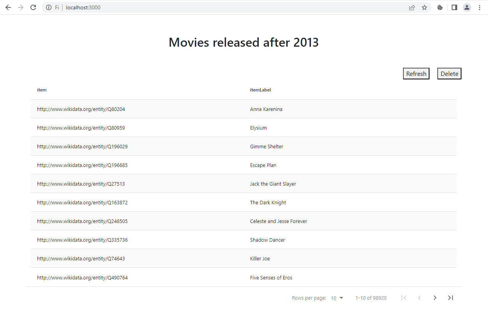

# WikiData (movies released after 2013)
SPARQL query project. Front-end is React, Back-end is Flask

## How to run

In the project directory, you can run:

### `npm install`
### `npm start`

And then run flask api

### `npm run start-api`

>Before running flask api, you must build python3 virtual environment named ```movies-list```.
In the virtual environment, you must run:
>
>### `pip install -r requirements.txt`

## Wikidata Query (SPARQL)
```
#Movies released in 2013
SELECT DISTINCT ?item ?itemLabel WHERE {
    ?item wdt:P31 wd:Q11424.
    ?item wdt:P577 ?pubdate.
    FILTER(?pubdate >= "2013-01-01T00:00:00Z"^^xsd:dateTime)
    SERVICE wikibase:label { bd:serviceParam wikibase:language "[AUTO_LANGUAGE],en". }
}
```
## User Interface
